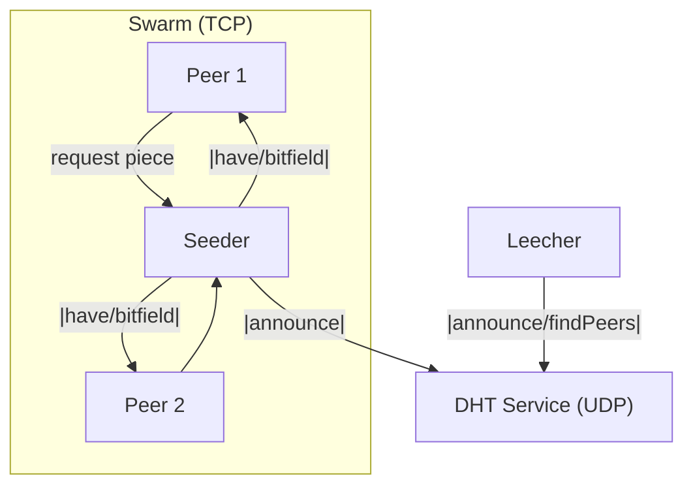

# Peer‑to‑Peer File Sharing with BitTorrent

> **Project 16 – Distributed Systems Course**  
> A minimal BitTorrent‑style P2P client written in Go.  
> It implements chunked file transfer, _rarest‑first_ piece selection and decentralised peer discovery via a light‑weight DHT.


---

## Table of Contents
1. [Features](#features)
2. [Quick Start](#quick-start)
3. [Command‑line Interface](#command-line-interface)
4. [How it Works](#how-it-works)
5. [Project Layout](#project-layout)
6. [Observability & Logging](#observability--logging)
7. [Validation Checklist](#validation-checklist)
8. [Roadmap](#roadmap)
9. [Contributing](#contributing)
10. [License](#license)

---

## Features

- 📦 **Chunked transfer** – files are split into 256 KiB pieces which are verified by SHA‑1.  
- 🎲 **Rarest‑first scheduling** – always request the least‑available piece in the swarm.  
- 🌐 **Tracker‑less peer discovery** – small JSON‑based DHT inspired by Kademlia (160‑bit XOR space, _k_=8).  
- ⚡ **Fully concurrent** – each peer connection has independent goroutine reader/writer pairs; the DHT runs its own UDP dispatcher.  
- 📝 **Structured JSON logs** – perfect for piping through `jq` or shipping to ELK/Grafana.  
- 🧪 **Self‑contained test‑suite** – unit tests for storage splitting/joining and metainfo JSON encoding.

---

## Quick Start

> Requires **Go 1.22+**. All commands run inside the project root.

```bash
# 1 . Install dependencies (none external, Go modules vendor everything)
go test ./...             # run unit tests

go build ./cmd/bittorrent # build the single binary
```

### One‑machine demo (4 terminals)

**DHT‑only node (Terminal 1)**

```bash
./bittorrent -dht-listen :10000 -tcp-listen :10001
```

**Seeder (Terminal 2)**

```bash
./bittorrent -seed ~/Movies/big_buck_bunny.mp4 -dht-listen :20000 -tcp-listen :20001 -bootstrap :10000
```

**Leecher → Seeder (Terminal 3)**

```bash
./bittorrent -get ~/Movies/big_buck_bunny.mp4.bit -dest ~/Downloads -dht-listen :30000 -tcp-listen :30001 -bootstrap :10000 -keep 1200
```

**Leecher #2 (Terminal 4)**

```bash
./bittorrent -get ~/Movies/big_buck_bunny.mp4.bit -dest ~/Downloads -dht-listen :40000 -tcp-listen :40001 -bootstrap :10000
```

Pipe the output of each terminal to [`jq`](https://stedolan.github.io/jq/) for pretty log formatting:

```bash
./bittorrent -dht-listen :10000 ... | jq .
```

---

## Command‑line Interface

| Flag | Purpose | Example |
|------|---------|---------|
| `-seed <file>` | Seed the given payload file. Generates `<file>.bit` on first run. | `-seed ~/Movies/foo.mkv` |
| `-get <meta.bit>` | Download a file given its `.bit` metainfo. | `-get foo.mkv.bit` |
| `-dest <dir>` | Output directory for downloaded file. | `-dest ~/Downloads` |
| `-tcp-listen <addr>` | TCP listen address, e.g. `:0` (random port) or `0.0.0.0:6881`. | `-tcp-listen :20001` |
| `-dht-listen <addr>` | UDP listen address for DHT. Empty disables DHT. | `-dht-listen :20000` |
| `-bootstrap <addr[,addr]>` | Comma‑separated list of UDP bootstrap nodes. | `-bootstrap :10000,example.com:20000` |
| `-peer <addr[,addr]>` | Static list of TCP peers (optional shortcut instead of DHT). | `-peer 1.2.3.4:20001` |
| `-keep <sec>` | After downloading, continue seeding for _n_ seconds. | `-keep 600` |

---

## How it Works



* **Session** orchestrates one torrent: holds `Meta`, in‑memory piece cache and spawns **DHT** + **Swarm**.
* **Swarm** maintains active TCP peers and triggers _rarest‑first_ selection every 2 s.
* **DHT Service** wraps a UDP node that speaks five JSON messages: `ping`, `pong`, `announce`, `findPeers`, `peers`.

More design details (data structures, algorithms, diagrams) live in [`report.tex`](./report.tex) – grab the compiled PDF for the full write‑up.

---

## Project Layout

```text
cmd/bittorrent/       ← main() + CLI
internal/
  app/                ← Session, Swarm, DHT service, CLI config
  dht/                ← UDP node & routing table (Kademlia‑like)
  peer/               ← TCP peer object (reader + writer goroutines)
  protocol/           ← Message framing, handshake, hashes
  storage/            ← Piece split/join + bitfield utils
  logger/             ← JSON line logger
  metainfo/           ← .bit file marshal/unmarshal
tests/                ← Additional integration tests
```

---

## Observability & Logging

All subsystems emit **structured JSON** lines to `STDOUT`:

```json
{"event":"request","piece":42,"peer":"127.0.0.1:20001","ts":"2025‑04‑27T15:41:09Z"}
```

Pipe into `jq`/`bunyan`/`loki‑promtail` for real‑time dashboards. Key events:

| Event | Meaning |
|-------|---------|
| `joined_to_peer` | Successful TCP dial. |
| `have` | A piece finished downloading. |
| `complete` | Full file assembled on disk. |
| `dht_*` | Any DHT interaction (ping/pong/announce/findPeers). |

---

## Validation Checklist

- [x] **Upload & download a file via chunk exchange** – demonstrated in the Quick Start scenario.  
- [x] **Log peer join/leave & chunk updates** – see JSON samples above.  
- [x] **Visualise download progress per peer** – aggregate `have` events in Grafana/Loki or simply observe order in logs.

---

## Roadmap

- NAT traversal (uTP / hole‑punching)  
- Multi‑file torrents & web seeding  
- Incentive layer (tit‑for‑tat)  
- Periodic DHT re‑announce & seed expiration  

---

## Contributing

1. Fork ℹ️  
2. Create a feature branch (`git checkout -b awesome‑feature`)  
3. Commit your changes with clear messages  
4. Push & open a Pull Request

_Coding style: `go fmt ./...` + `golangci‑lint run` passes._

---

## License

This project is licensed under the **MIT License**

